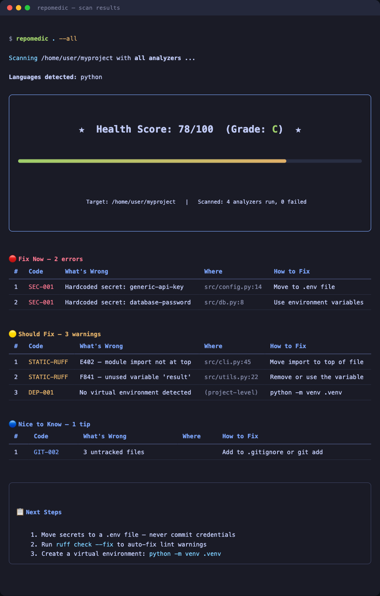
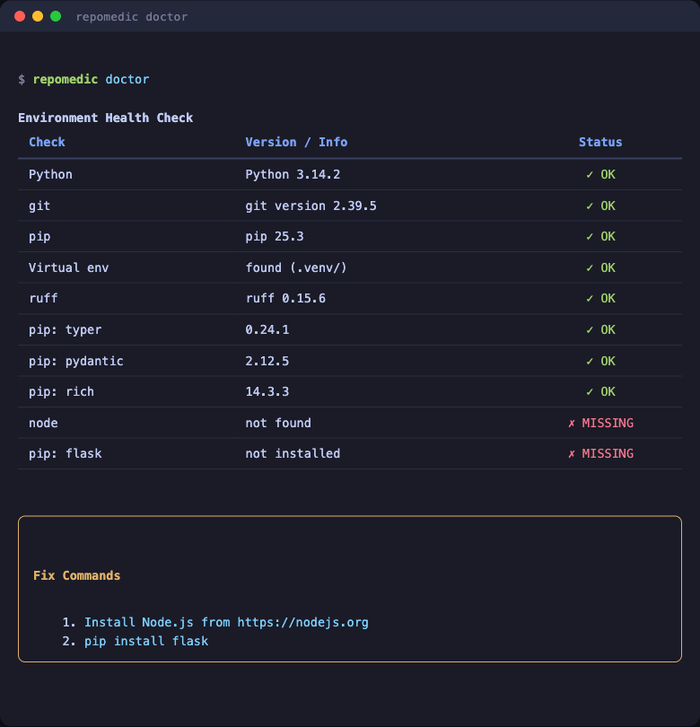
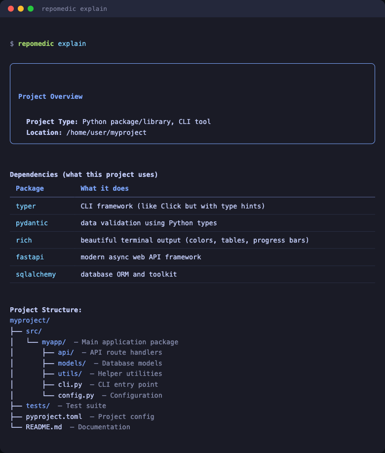
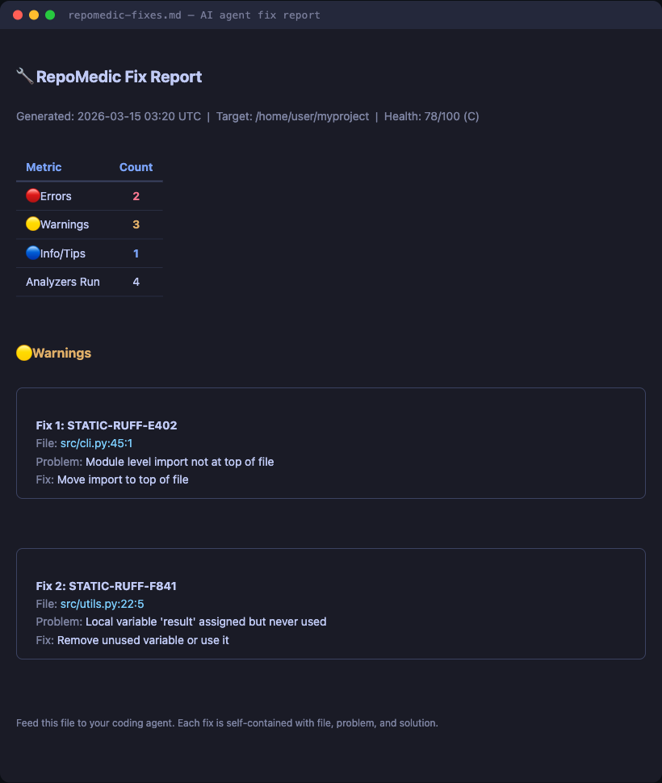

# RepoMedic

**Agent-first repo bug sniffer — diagnose issues in any folder or repo from the command line, and hand the fixes to a coding agent.**

RepoMedic scans a codebase with 13 analyzers, scores its health, and emits a structured markdown fix report designed to drop straight into an AI coding agent's context window. Agents run it as a tool; humans get a friendly terminal UI from the same commands.



---

## Why

Debugging a broken or messy repo burns time — and for AI agents, it burns tokens. An agent that greps and reads files to *find* problems spends most of its context window on discovery. RepoMedic collapses discovery into one command: it runs the linters, dependency checks, git inspection, secret scanning, and config validation in parallel, then hands back a compact, prioritized fix list with code snippets. The agent goes straight to fixing.

## Built agent-first

- **Zero prompts.** Every command is non-interactive by default (`--interactive` opt-in for humans).
- **Clean stdout.** `--output json` prints only JSON; `sniff` prints only the markdown report. Progress goes to stderr.
- **Meaningful exit codes.** `0` clean, `1` findings at/above `--fail-on`, `2` usage error — scriptable in CI and agent loops.
- **Token-budget aware.** `--max-findings` caps report size keeping the most severe; `--changed`/`--since REF` scope reports to files you touched.
- **Stable finding IDs.** Every finding has a `RM-xxxxxxxx` fingerprint that survives re-runs, so agents can track fix progress.
- **Self-describing.** `repomedic agents` prints the agent integration guide; see also [docs/AGENTS.md](docs/AGENTS.md).

```bash
# The agent workflow
repomedic sniff .                      # markdown fix report on stdout, exit 1 if errors
# ...agent fixes file by file...
repomedic sniff . --changed --fail-on error   # re-check only touched files; exit 0 = done
```

## What it checks

| Analyzer | What It Checks | Languages |
|---|---|---|
| **static** | Ruff linting, syntax errors, Bandit, circular imports | Python |
| **dependencies** | Missing/broken packages, venv health | Python |
| **javascript** | Syntax, ESLint, TypeScript (`tsc`), `npm audit`, lockfiles | JS / TS |
| **go** | Build errors, `go vet`, module verification, `govulncheck` | Go |
| **rust** | `cargo check`, Clippy, `cargo audit`, lockfile | Rust |
| **shell** | `bash -n` syntax checks, ShellCheck | Shell |
| **git** | Merge conflicts, uncommitted changes, detached HEAD, .gitignore | any |
| **config** | pyproject/package.json/Dockerfile/.env validation, JSON/YAML/TOML syntax across the repo, README/LICENSE presence | any |
| **security** | Hardcoded secrets (Gitleaks + patterns), tracked .env, DEBUG mode | any |
| **hygiene** | Oversized files, TODO/FIXME buildup, broken symlinks | any |
| **logs** | Error patterns and tracebacks in log files | any |
| **semgrep** | Advanced multi-language SAST (if installed) | 30+ |
| **runtime** | Execute a script and analyze the failure; capture Python frames and locals through DAP (`repomedic debug`) | py, js, sh, rb, php, pl, lua |

Language detection covers 30+ languages (Python, JS/TS, Go, Rust, Java, Kotlin, C/C++, C#, Ruby, PHP, Swift, shell, SQL, Terraform, …) and drives per-language verify commands in the fix report.

## Commands

| Command | What It Does |
|---|---|
| `repomedic sniff [PATH]` | **The agent command**: scan and print the markdown fix report to stdout; exit 1 on errors |
| `repomedic [PATH]` | Scan with a rich terminal UI (health score, tables) — shorthand for `repomedic scan` |
| `repomedic run script.py` | Run a script (any supported language) and analyze the failure |
| `repomedic debug script.py` | Capture an uncaught Python exception with bounded frames and redacted locals |
| `repomedic doctor` | Check the dev environment: interpreters, toolchains, project dependencies |
| `repomedic selfcheck` | Verify installed-package integrity, schemas, rendering safety, and the bundled scan pipeline |
| `repomedic explain` | Describe a project: type, languages, dependencies, structure |
| `repomedic fix [--dry-run]` | Auto-fix safe issues (ruff, .gitignore, .env.example) |
| `repomedic list-analyzers` | List available analyzers |
| `repomedic agents` | Print the agent integration cheat sheet |

All commands accept `--output json` (and markdown where it makes sense) for machine consumption.

## Install

```bash
git clone https://github.com/MBemera/repomedic.git
cd repomedic
pip install -e .

# optional: deeper analysis tools
pip install -e ".[tools]"        # semgrep + bandit

# optional: debugger capture only (included by the dev extra)
pip install -e ".[debug]"        # debugpy
```

Requires **Python 3.11+**. Core dependencies: `typer`, `pydantic`, `rich`, `pyyaml`. External tools (ruff, node, go, cargo, shellcheck, gitleaks) are used when present and skipped gracefully when not — `repomedic doctor` shows what's available.

## Quick Start

```bash
# Agent-ready fix report on stdout
repomedic sniff .

# Human-friendly scan of the current directory
repomedic

# Scan a GitHub repo directly
repomedic https://github.com/user/repo

# Machine-readable full report
repomedic . --output json

# Only findings in files you changed since main
repomedic sniff . --since origin/main

# Restrict analyzers, drop info-level findings, cap the report
repomedic . -a static,git,security -s warning --max-findings 25

# Gate CI on errors
repomedic . -o json --fail-on error

# Capture a Python crash with frames and local variables
repomedic debug path/to/script.py --timeout 60 -o json

# Use the same debugger path through the multi-language run command
repomedic run path/to/script.py --debug -o markdown

# Verify the installed RepoMedic package and emit a machine-readable result
repomedic selfcheck -o json
```

## VS Code Extension

The development extension in `editors/vscode/` adds workspace scans to the
Problems panel, shows the RepoMedic health score in the status bar, and exposes
interactive debugging and bounded crash-state capture from Python diagnostics.
It is not published to the VS Code Marketplace yet.

Install RepoMedic with debugger support, install the extension's pinned Node
dependencies, then open the extension folder in VS Code:

```bash
pip install -e ".[debug]"
cd editors/vscode
npm ci --ignore-scripts
code .
```

Press `F5` to compile the TypeScript and open an Extension Development Host.
From that window, run **RepoMedic: Scan Workspace**, **RepoMedic: Debug Current
File**, or **RepoMedic: Clear Diagnostics** from the Command Palette. Use
`npm test` for the extension unit tests and `npm run package` to build a local
VSIX; Marketplace publishing is intentionally out of scope for this release.

The extension requires a trusted, filesystem-backed workspace and rejects
virtual workspaces. Scans default to `repomedic.extraArgs = ["--no-exec"]`; enabling
repo-controlled tool execution should be a deliberate choice for code you
trust. `repomedic.path` and `repomedic.extraArgs` are machine-scoped settings,
and RepoMedic is invoked with argument arrays rather than a shell. Scan output,
argument sizes, time, and diagnostic counts are bounded. See
[the extension guide](editors/vscode/README.md) for configuration and security
details.

## The fix report

`repomedic sniff` (or `--output markdown`) produces a report with YAML front matter (machine-readable counts), findings grouped by file with stable IDs and code snippets, and a verification checklist:

```markdown
### `src/app.py` — 1 error, 2 warnings

#### RM-105466e2 `STATIC-001` error — Syntax error (line 4) `[python]`

invalid syntax

**Fix:** Fix the syntax error: invalid syntax

​```python
  2 | import json
  3 |
> 4 | def broken(:
  5 |     pass
​```
```

Each finding is self-contained: file, line, problem, suggested fix, and the offending code — an agent can usually fix it without reading the file. Full format documentation: [docs/AGENTS.md](docs/AGENTS.md).

## Per-repo configuration

Pin scan behavior in `.repomedic.toml` at the repo root (or `[tool.repomedic]` in `pyproject.toml`); CLI flags override it:

```toml
analyzers = ["static", "git", "security", "config"]
exclude = ["migrations", "vendor"]
min_severity = "warning"
max_findings = 50
fail_on = "error"
include_tests = false
```

## Exit codes

| Code | Meaning |
|---|---|
| `0` | Nothing at/above the `--fail-on` threshold (scan default: `never`; sniff default: `error`) |
| `1` | Findings at/above the threshold |
| `2` | Usage error (bad path, unknown analyzer, invalid flag) |

## Screenshots

#### Scan Results — health score, categorized findings, next steps


#### Doctor — environment health check


#### Explain — project overview


#### Fix Report — AI agent output


## Project Structure

```
src/repomedic/
├── cli.py                 # Typer CLI (scan/sniff/run/doctor/explain/fix/agents)
├── models.py              # Pydantic models (Finding, ScanReport, fingerprints)
├── core/
│   ├── scanner.py         # Orchestrator — parallel analyzers, filtering, truncation
│   ├── context.py         # ScanContext — file discovery, language classification
│   ├── languages.py       # Language registry (30+ languages, fences, verify commands)
│   └── config.py          # .repomedic.toml / [tool.repomedic] loader
├── analyzers/
│   ├── base.py            # BaseAnalyzer interface
│   ├── static.py          # Ruff / Bandit / syntax / circular imports (Python)
│   ├── dependencies.py    # Python dependency health
│   ├── javascript.py      # ESLint, tsc, npm audit
│   ├── golang.py          # go build/vet, govulncheck
│   ├── rust.py            # cargo check, clippy, cargo audit
│   ├── shell.py           # bash -n, ShellCheck
│   ├── git.py             # Repo health
│   ├── config.py          # Config validation + data-file syntax + project docs
│   ├── security.py        # Secret/credential detection
│   ├── hygiene.py         # Large files, TODO buildup, broken symlinks
│   ├── logs.py            # Log file parsing
│   ├── semgrep.py         # Semgrep integration
│   └── runtime.py         # Multi-language script execution analysis
├── commands/
│   ├── doctor.py          # Environment checks (collect/render split)
│   ├── explain.py         # Project explanation (collect/render split)
│   ├── fix.py             # Auto-fixer (with --dry-run)
│   └── agents.py          # Agent integration guide
├── output/
│   ├── rich_output.py     # Terminal UI
│   ├── markdown_output.py # Agent handoff report
│   └── json_output.py     # JSON output
├── debug/
│   ├── dap.py             # Bounded Debug Adapter Protocol transport
│   └── session.py         # Headless debugpy crash capture
└── utils/
    ├── process.py         # Subprocess runner with timeouts
    ├── fs.py              # File discovery with ignore rules
    └── vcs.py             # Git changed-file discovery

editors/vscode/
├── src/extension.ts       # VS Code commands, diagnostics, debugging, code actions
├── src/files.ts           # Canonical workspace and symlink containment
├── src/report.ts          # Pure report-to-diagnostic mapping
└── src/runner.ts          # Bounded, shell-free RepoMedic process execution
```

## Validation and verification

`repomedic selfcheck` is the installed-package smoke test. It checks all 13
analyzer imports, isolated Python and Git availability, a bundled no-exec scan,
the exported schemas, markdown rendering safety, and optional extras. It exits
`0` only when every required check passes; `extras-status` is informational.

The full V&V framework lives in a source checkout under `vv/` and `tests/` and
is intentionally excluded from the wheel:

```bash
repomedic selfcheck -o json          # installed-package integrity
pytest -q -m "not toolchain"         # portable suite
pytest -q tests/contract             # output and exit-code contracts
pytest -q -m adversarial             # hostile-input and boundary tests
pytest -q -m corpus                  # ground-truth cases; unavailable tools skip
python -m vv.scorer                  # precision/recall threshold table
python -m vv.scorer --strict         # fail when a declared toolchain is missing
```

CI also runs strict corpus scoring with the declared external toolchains,
enforces the 75% coverage floor, audits dependencies, and dogfoods the built
wheel with `selfcheck` and a no-exec repository scan.

## Development

```bash
pip install -e ".[dev]"
pytest                      # run tests
ruff check src/ tests/      # lint

cd editors/vscode
npm ci --ignore-scripts
npm test                    # compile and test the VS Code extension
npm audit --audit-level=high
```

## License

MIT
